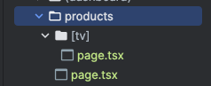
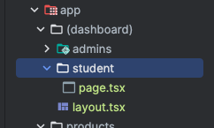

## Роутинг

В папке APP
Создаем папку с именем страницы, в ней файл page.tsx

Если мы хотим к примеру категорию создать к примеру
http://localhost:3000/products/tv , то создадим папку [slag]

Если хотим сделать 1 layout, но разные страницы и что бы в в адресной строке не пропивалась 1 часть те как называется
корневая папка http://localhost:3000/student
Создаем папку с () скобками к примеру (dashboard), туда помещаем наши page к примеру student/page.tsx

## Клиентские и серверные компоненты:

Если пишем там какие-то к примеру google карты или yandex карты, или какие-то редакторы тексты - Клиентские компоненты

Если серверные, то лучше использовать:
ISR (Incremental-static-regeneration - статика переобновляемая) лучший вариант, или
SSG (Static-site-generation статика) данные подгружаются 1 раз. 
Удобно на PublicPage - типо блог, там где важна SEO оптимизация
Проверка авторизации до того как прогрузилась страница

## SEO оптимизация

Добавляем метаданные в header и т.д.

const metadata: Metadata = {
    title: 'Products'
}

## Docker

docker build -t test:1.0.0 .   #собираем образ

docker run -it --rm --name testRun \
-e ROOT_ENV_SERVER="SEEEEERVERRRRR" \
-e NEXT_PUBLIC_API_URL="TESTTTTT CLOIEEEEEE" \
-p 8080:3000 \
test:1.0.0

Запускаем image и прокидываем переменные окружения